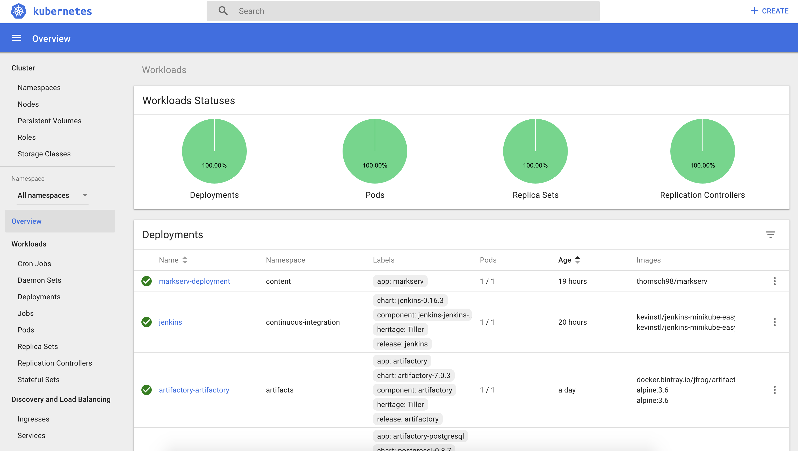
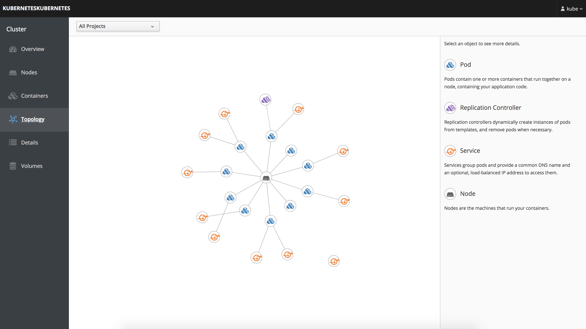
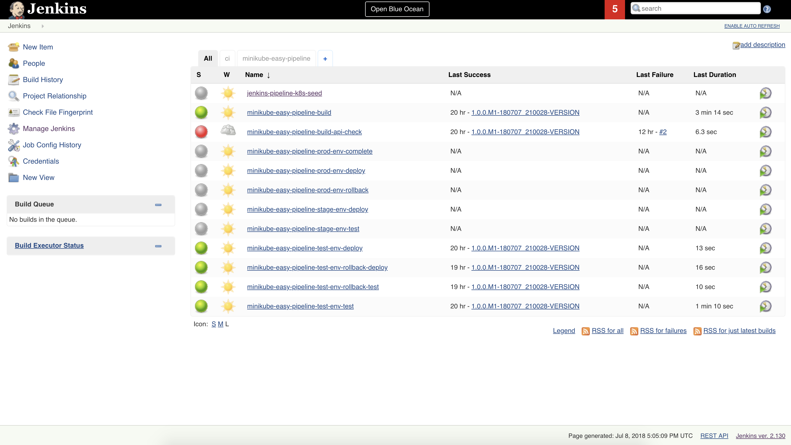
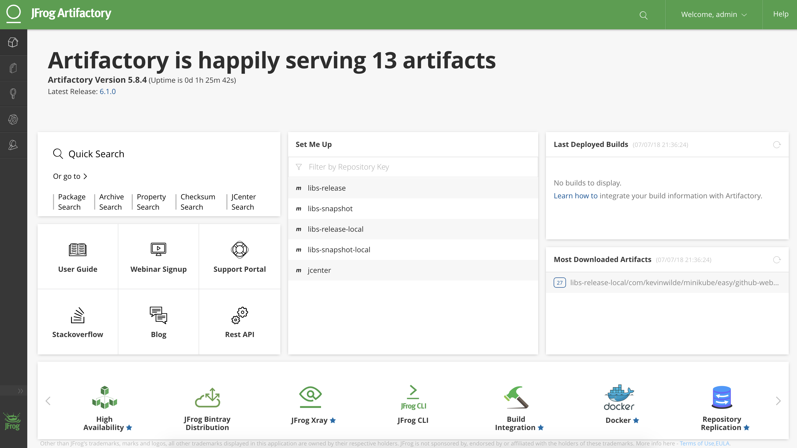

# Minikube Easy

Minikube Easy is a collection of bash scripts and templates that simplify the installation of minikube and local development infrastructure. 

[Minikube](https://github.com/kubernetes/minikube) is a great initiative for running [Kubernetes](https://kubernetes.io/docs/home) on your local workstation for developing locally. While kubernetes and minikube are under constant development this project aims to ensure a stable development environment using minikube.

 
 
 
 
 
 
 
 

Minikube Easy combines excellent technologies for you so that you can start developing as quickly as possible so that you don't have to spend your time researching how to wire things together, it has been done for you.

[Jenkins X Coming Soon...](https://jenkins-x.io) 

### Key Features

* Installation of minikube, [hyperkit](https://github.com/moby/hyperkit), [kubectl](https://kubernetes.io/docs/reference/kubectl/overview) and development tools via one-liner shell commands.
* Jenkins installation pre-configured with plugins required for builds and deployments using [Spring Cloud Pipelines](https://cloud.spring.io/spring-cloud-pipelines).
* [Cockpit](https://cockpit-project.org) installation to simplify interaction with kubernetes, including shell access to containers.
* Simple installation of [Artifactory](https://jfrog.com/artifactory) to support most artifact repository requirements.
* One-liner installation of all development tools required for local development and deployment into minikube.
* Host volume mounted in minikube and various pods so that pod may access changes on host in real time.

The scripts provided are confirmed to work on **macOS** High Sierra Version 10.13.5.

### Preparing For Installations

Follow these steps to use any portion of Minikube Easy:

Clone the https://github.com/kevinstl/minikube-easy.git project. 

`git clone https://github.com/kevinstl/minikube-easy.git`

Change to minikube-easy/scripts directory.

`cd minikube-easy/scripts`

All install scripts have a corresponding uninstall script.

### Local Development Installation

The local-development-install.sh script installs minikube, hyperkit, kubectl, jenkins, cockpit and artifactory. If you choose to install everything using this script there is no need to execute the  installation scripts described below this instruction. However you have the option to install individual tools if you prefer as described below this instruction.

Add required credentials to [credentials.xml](#credentials-xml).

`./local-development-install.sh ~/tmp/credentials.xml`

Once the installation has completed you should be able to navigate to the following:

[Dashboard at http://minikube-easy:30000](http://minikube-easy:30000)

[Cockpit at http://minikube-easy:30009](http://minikube-easy:30009) username: kube password: changeme

[Jenkins at http://minikube-easy:30010](http://minikube-easy:30010)

[Artifactory at http://minikube-easy:30011](http://minikube-easy:30011)

### credentials.xml

"~/tmp/credentials.xml" is a recommended location of the credentials.xml file with your credentials for github and dockerhub provided. You can use [conf/credentials.xml](https://github.com/kevinstl/minikube-easy/blob/master/conf/credentials.xml) for an example. It is recommended that you DO NOT modify and use the example credentials.xml in this repo as you might accidentally commit that file to github with your personal credentials included. 

In order for the spring cloud pipeline to run properly you will have to provide your own credentials in "your-git-username", "your-git-password", "your-dockerhub-username" and "your-dockerhub-password".

### Running Example Spring Cloud Pipelines.

If you have installed everything required for local development via the local-development-install.sh script you can test it out using spring cloud pipelines. This example will create a Spring Cloud Pipeline in Jenkins that you will be able to execute.

Navigate to your [Artifactory](http://minikube-easy:30011) instance. Login with username: admin password: password. From top right drop down choose Quick Setup. Create Maven Repository.  The example spring cloud pipeline will deploy artifacts to this Maven repository in Artifactory. 

Use the install-config-jenkins-pipeline-k8s-seed.sh script to create your spring cloud pipelines jenkins jobs seed. Replace your-project-name with your project name.

`cd spring-cloud-pipeline`

 `./install-config-jenkins-pipeline-k8s-seed.sh your-project-name`
 
 In Jenkins execute the [jenkins-pipeline-k8s-seed](http://minikube-easy:30010/job/jenkins-pipeline-k8s-seed) job. After that job is complete execute the [minikube-easy-pipeline](http://minikube-easy:30010/view/minikube-easy-pipeline) job.

### Installing Minikube Instance Alone

The install.sh script will strictly install what is required to run only minikube.

Execute install.sh - This installs everything needed to run minikube on your machine. It installs kubectl, hyperkit and minikube.

`./install.sh`

### Starting Minikube

Start minikube with the start.sh script.

`./start.sh`

### Stopping Minikube

Stop minikube with the stop.sh script.

`./stop.sh`

### Uninstalling Minikube

The uninstall.sh script will uninstall minikube and it's dependencies.

Execute uninstall.sh - This uninstalls everything needed to run minikube on your machine. It uninstalls kubectl, hyperkit and minikube.

`./ininstall.sh`

### Install Cockpit.

[Cockpit](https://cockpit-project.org/) provides a rich graphical interface to kubernetes including a topology view of resources and direct shell access to containers running in kubernetes.

Execute cockpit-install.sh - This will install Cockpit. 

`./cockpit-install.sh`

Once installed you will need to use the start-with-cockpit.sh script to start minikube.  The start-with-cockpit.sh script starts minikube with basic authentication support so that you may log into Cockpit.

`./start-with-cockpit.sh`

### Install Jenkins

Jenkins is an industry trusted continuous integration service.

Execute jenkins-install.sh - This will install Jenkins. 

`./jenkins-install.sh  ~/tmp/credentials.xml`

Add required credentials to [credentials.xml](#credentials-xml).

### Install Docker Registry.

The registry-install.sh installs a docker registry. It is most likely not necessary to run a docker registry locally as minikube is able to pick up docker images that you build locally if you are building your docker images using the docker daemon within minikube by executing the `eval $(minikube docker-env)` command.

`./registry-install.sh`

Add insecure registry address to docker:

 
 
 ### Reusing the Docker daemon
 
 You may [reuse the minikube docker daemon](https://github.com/kubernetes/minikube/blob/master/docs/reusing_the_docker_daemon.md) from your workstation shell. The benefit to doing this is that you can execute a docker build and the image you build is immediately available to your minikube instance rather than having to deploy to and pull from a docker registry.
 
 Additionally minikube is resource intensive so you can reduce load on your workstation by not having to run a separate daemon instance to run docker commands.
 
Execute minidocker-install.sh to make the minidocker available from any shell location.

`./minidocker-install.sh`

